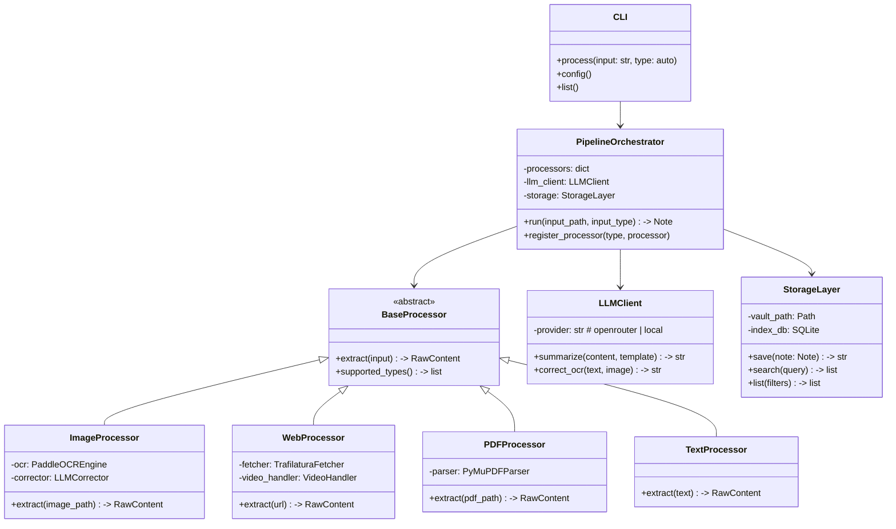
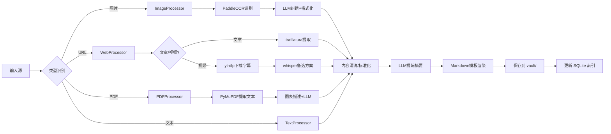

# 个人知识库构建工具 — 系统架构设计

> 架构师输出 v0.1 | 2026-03-17

---

## 1. 系统总览

### 1.1 设计目标

| 目标 | 说明 |
|------|------|
| **统一入口** | CLI 一条命令搞定所有输入类型 |
| **插件式扩展** | 新增输入类型只需加一个 processor |
| **本地优先** | 数据在本地，LLM 调用可选 |
| **OpenClaw 原生集成** | 作为 OpenClaw 技能 / ACP 服务运行 |

### 1.2 架构图（ASCII Art）

```
┌─────────────────────────────────────────────────────────────┐
│                     Personal KB Builder                     │
├─────────────────────────────────────────────────────────────┤
│                                                             │
│  ┌──────────┐  ┌──────────┐  ┌──────────┐  ┌──────────┐   │
│  │   图片    │  │   URL    │  │   PDF    │  │   文本    │   │
│  │  Input   │  │  Input   │  │  Input   │  │  Input   │   │
│  └────┬─────┘  └────┬─────┘  └────┬─────┘  └────┬─────┘   │
│       │              │              │              │         │
│       ▼              ▼              ▼              ▼         │
│  ┌──────────┐  ┌──────────┐  ┌──────────┐  ┌──────────┐   │
│  │  Image   │  │  Web /   │  │  PDF     │  │  Text    │   │
│  │Processor │  │  Video   │  │Processor │  │Processor │   │
│  │          │  │Processor │  │          │  │          │   │
│  │ PaddleOCR│  │trafilatura│ │ PyMuPDF  │  │  pass    │   │
│  │ + LLM    │  │ + yt-dlp │  │ + LLM    │  │          │   │
│  │  纠错     │  │ + whisper│  │          │  │          │   │
│  └────┬─────┘  └────┬─────┘  └────┬─────┘  └────┬─────┘   │
│       │              │              │              │         │
│       ▼              ▼              ▼              ▼         │
│  ┌──────────────────────────────────────────────────────┐   │
│  │              Pipeline Orchestrator                    │   │
│  │  ┌──────────┐  ┌──────────┐  ┌──────────┐           │   │
│  │  │  清洗/   │  │  LLM     │  │ Markdown │           │   │
│  │  │  标准化  │→ │  提炼    │→ │  渲染    │           │   │
│  │  └──────────┘  └──────────┘  └──────────┘           │   │
│  └───────────────────────┬──────────────────────────────┘   │
│                          │                                   │
│                          ▼                                   │
│  ┌──────────────────────────────────────────────────────┐   │
│  │                  Storage Layer                       │   │
│  │  ┌──────────────┐    ┌──────────────┐                │   │
│  │  │ Markdown 文件 │    │ SQLite 索引  │                │   │
│  │  │ ./notes/     │    │ (tags, search)│                │   │
│  │  └──────────────┘    └──────────────┘                │   │
│  └──────────────────────────────────────────────────────┘   │
│                                                             │
├─────────────────────────────────────────────────────────────┤
│  Integration: CLI │ OpenClaw Skill │ ACP Service │ MCP      │
└─────────────────────────────────────────────────────────────┘
```

### 1.3 Mermaid 类图



### 1.4 数据流图



---

## 2. 组件详细设计

### 2.1 Processor（处理器）接口

每个处理器实现统一接口：

```python
from abc import ABC, abstractmethod
from dataclasses import dataclass
from pathlib import Path

@dataclass
class RawContent:
    """处理器提取的原始内容"""
    text: str                    # 提取的纯文本
    metadata: dict               # 来源元数据（标题、作者、日期等）
    source_type: str             # image | web_article | web_video | pdf | text
    source_path: str             # 原始来源路径/URL
    media_files: list[Path] = None  # 附带的图片/附件

class BaseProcessor(ABC):
    @abstractmethod
    def can_handle(self, input_path: str) -> bool:
        """判断是否能处理该输入"""
        ...

    @abstractmethod
    def extract(self, input_path: str) -> RawContent:
        """提取内容为结构化原始数据"""
        ...
```

### 2.2 ImageProcessor（图片处理器）

```
输入: 图片文件 / 图片URL
  ↓
PaddleOCR 识别（中文优先）
  ↓
原始文本（含可能的OCR错误）
  ↓
LLM 纠错 + 格式化（可选，依赖图片上下文）
  ↓
RawContent
```

**关键设计**：
- 优先使用 PaddleOCR，中文识别准确率显著高于 Tesseract
- 多图场景：逐一 OCR → 拼接 → 整体 LLM 格式化
- LLM 纠错通过 vision model（带原图校验），不纯靠文本推断

### 2.3 WebProcessor（网页/视频处理器）

```
输入: URL
  ↓
类型判断（文章 / 视频平台）
  ├─ 文章 → trafilatura 提取正文 → RawContent
  └─ 视频 → yt-dlp 提取字幕 → RawContent
           └─ 无字幕 → whisper 转录（备选）
```

**关键设计**：
- URL 平台识别：YouTube/B站/抖音 → 视频管线；其他 → 文章管线
- trafilatura 优先：对微信公众号、CSDN 等中文站点支持好
- yt-dlp 已装，直接复用；whisper 作为本地备选（需 GPU 或 CPU 耐心等待）

### 2.4 PDFProcessor（PDF 处理器）

```
输入: PDF 文件
  ↓
PyMuPDF 提取文本层
  ├─ 有文本层 → 直接提取 + 布局分析
  └─ 纯扫描件 → 调用 ImageProcessor 做 OCR
  ↓
表格提取（Camelot / PyMuPDF table）
图片区域检测 + 截图送 LLM 描述
  ↓
RawContent
```

### 2.5 Pipeline Orchestrator（管线编排器）

核心编排逻辑：

```python
class PipelineOrchestrator:
    def __init__(self, config: Config):
        self.processors: list[BaseProcessor] = [
            ImageProcessor(config),
            WebProcessor(config),
            PDFProcessor(config),
            TextProcessor(config),
        ]
        self.llm = LLMClient(config)
        self.storage = StorageLayer(config)
        self.templates = TemplateEngine(config)

    def process(self, input_path: str) -> Note:
        # 1. 自动检测或指定类型
        processor = self._route(input_path)

        # 2. 提取原始内容
        raw = processor.extract(input_path)

        # 3. 内容清洗（去 HTML 标签、统一编码等）
        cleaned = self._clean(raw)

        # 4. LLM 提炼（摘要 + 结构化 + 知识点）
        refined = self.llm.summarize(
            content=cleaned.text,
            metadata=cleaned.metadata,
            template=self.templates.get(raw.source_type)
        )

        # 5. 渲染为 Markdown
        note = self.templates.render(refined, raw.metadata)

        # 6. 存储 + 索引
        path = self.storage.save(note)
        self.storage.index(note)

        return note
```

---

## 3. 技术选型

### 3.1 OCR 引擎

| 维度 | PaddleOCR | Tesseract 5 | API (DeepSeek-OCR-2) |
|------|-----------|-------------|----------------------|
| **中文准确率** | ⭐⭐⭐⭐⭐ (~97%) | ⭐⭐⭐ (~85-90%) | ⭐⭐⭐⭐⭐ (~98%) |
| **英文准确率** | ⭐⭐⭐⭐ | ⭐⭐⭐⭐ | ⭐⭐⭐⭐⭐ |
| **表格识别** | ⭐⭐⭐⭐ (PP-Structure) | ⭐⭐ | 取决于模型 |
| **手写体** | ⭐⭐⭐ | ⭐⭐ | ⭐⭐⭐⭐⭐ |
| **部署复杂度** | 中（需 Python 依赖） | 低（apt install） | 低（API 调用） |
| **速度（CPU）** | 快 | 中 | 慢（网络延迟） |
| **离线可用** | ✅ | ✅ | ❌ |
| **成本** | 免费 | 免费 | 按 token 计费 |
| **GPU 加速** | ✅ (PaddlePaddle) | ❌ | N/A |

**选型结论**：**PaddleOCR 为主，API 方案备选**

理由：
- Boss 主要处理中文内容，PaddleOCR 中文准确率远超 Tesseract
- PP-Structure 模块原生支持表格和版面分析，省去额外处理
- 离线可用，不依赖网络
- 等 GPU 到位后可以跑本地大模型 OCR
- Tesseract 仅作为 fallback（简单英文文档场景）

### 3.2 网页提取

| 维度 | trafilatura | newspaper3k | readability-lxml + custom |
|------|-------------|-------------|--------------------------|
| **中文支持** | ⭐⭐⭐⭐ | ⭐⭐⭐ | ⭐⭐⭐⭐（可控） |
| **正文提取质量** | ⭐⭐⭐⭐⭐ | ⭐⭐⭐ | ⭐⭐⭐⭐ |
| **元数据提取** | ⭐⭐⭐⭐ (标题/作者/日期) | ⭐⭐⭐⭐⭐ | ⭐⭐（需自建） |
| **反爬处理** | ⭐⭐⭐ | ⭐⭐ | ⭐⭐ |
| **维护活跃度** | ✅ 活跃 | ⚠️ 维护缓慢 | ✅ 稳定 |
| **微信公众号** | ⭐⭐⭐⭐ | ⭐⭐⭐ | ⭐⭐⭐ |
| **JS 渲染页** | ❌ | ❌ | ❌ |
| **安装体积** | 小 | 中（含 NLP 模型） | 小 |

**选型结论**：**trafilatura 为主，readability-lxml 为 fallback**

理由：
- trafilatura 在 benchmark 上表现最好，中文支持也不错
- 对微信公众号、CSDN 等主流中文站点实测效果好
- newspaper3k 维护停滞，且内置 NLP 模型增加体积
- readability-lxml 作为轻量备选，处理 trafilatura 失败的情况
- JS 渲染页面交给 OpenClaw 浏览器自动化兜底

### 3.3 视频字幕

| 维度 | yt-dlp 字幕提取 | whisper (本地) | 付费 API |
|------|----------------|----------------|----------|
| **速度** | ⚡ 极快（下载现有字幕） | 🐢 慢（需转录） | ⚡ 快 |
| **质量** | 取决于源字幕 | ⭐⭐⭐⭐⭐ (large-v3) | ⭐⭐⭐⭐ |
| **中文支持** | ✅（如有中文字幕） | ✅（需 large-v3） | ✅ |
| **成本** | 免费 | 免费（需算力） | 按分钟计费 |
| **离线可用** | ⚡ 下载后离线 | ✅ 完全离线 | ❌ |

**选型结论**：**yt-dlp 字幕优先 → whisper 备选**

理由：
- yt-dlp 可提取平台已有字幕（YouTube 自动字幕、B站 CC 字幕），速度秒级
- 无字幕时 fallback 到 whisper（large-v3 中文效果好）
- 分级策略：先尝试字幕下载 → whisper base 快速转录 → whisper large 精确转录
- 无需付费 API，全部本地处理

### 3.4 LLM 接口

| 维度 | OpenRouter API | 本地模型 (Ollama/vLLM) |
|------|---------------|----------------------|
| **可用性** | ✅ 当前可用 | ❌ 等 GPU |
| **模型选择** | ⭐⭐⭐⭐⭐（DeepSeek/GPT/Claude等） | ⭐⭐⭐（取决于显存） |
| **速度** | 取决于网络和模型 | ⚡ 本地推理快 |
| **成本** | 按 token 付费 | 免费（电费） |
| **隐私** | ⚠️ 数据发送到第三方 | ✅ 完全本地 |
| **上下文长度** | 取决于模型 | 受限于显存 |

**选型结论**：**OpenRouter API 为主，本地模型为长期目标**

理由：
- 当前无 GPU，OpenRouter 是唯一可行方案
- DeepSeek 系列通过 OpenRouter 调用性价比高
- 抽象 LLMClient 接口，后续 GPU 到位后无缝切换本地
- 本地模型优先考虑：Qwen2.5（中文强）/ DeepSeek-V3（推理强）

### 3.5 CLI 框架

| 维度 | Python (Typer) | Node.js (Commander/Yargs) |
|------|---------------|--------------------------|
| **ML 生态** | ⭐⭐⭐⭐⭐ (PaddleOCR/PyMuPDF等) | ⭐⭐ |
| **类型安全** | ⭐⭐⭐⭐ (Pydantic + Typer) | ⭐⭐⭐ (TypeScript) |
| **子进程调用** | ⭐⭐⭐⭐⭐ | ⭐⭐⭐⭐ |
| **异步支持** | ⭐⭐⭐⭐ (asyncio) | ⭐⭐⭐⭐⭐ (原生) |
| **依赖管理** | pip/uv | npm/pnpm |
| **与 OpenClaw 集成** | ACP subprocess | MCP / ACP |

**选型结论**：**Python (Typer)**

理由：
- 核心处理管线全是 Python 生态（PaddleOCR、PyMuPDF、trafilatura、whisper）
- Typer 比 Click 更现代，自带类型校验和自动生成 help
- 用 Node.js 写就得跨语言调 Python，增加复杂度没有收益
- uv 管理依赖，启动快

### 3.6 Markdown 输出模板

```markdown
# {标题}

> {来源类型} | {原始链接} | {处理日期}

## 📝 摘要

{LLM 生成的 2-3 句摘要}

## 🔑 要点

- 要点 1
- 要点 2
- ...

## 📋 详细内容

{结构化正文，保留关键细节}

## 🔗 关键链接

- [相关链接 1](url)
- [相关链接 2](url)

## 🏷️ 标签

{LLM 自动提取的标签}

---
*来源: {source} | 处理时间: {duration}s | 模型: {model}*
```

每种输入类型可以有自定义变体（视频模板增加时间戳标记，PDF 模块增加页码引用等）。

---

## 4. 存储方案

### 4.1 目录结构

```
~/.personal-kb/
├── config.yaml              # 配置文件
├── notes/                   # Markdown 笔记库（Obsidian 兼容）
│   ├── 2026-03-17/
│   │   ├── article-xxx.md
│   │   └── image-xxx.md
│   └── ...
├── attachments/             # 原始附件（图片、PDF 副本等）
│   └── 2026-03-17/
│       └── img_xxx.png
├── index.db                 # SQLite 全文索引
├── templates/               # Markdown 模板
│   ├── article.md.j2
│   ├── video.md.j2
│   ├── image.md.j2
│   └── pdf.md.j2
└── logs/
    └── processing.log
```

### 4.2 SQLite 索引 Schema

```sql
CREATE TABLE notes (
    id TEXT PRIMARY KEY,
    title TEXT NOT NULL,
    source_type TEXT NOT NULL,       -- image/web_article/web_video/pdf/text
    source_url TEXT,
    file_path TEXT NOT NULL,
    created_at TIMESTAMP DEFAULT CURRENT_TIMESTAMP,
    summary TEXT,
    word_count INTEGER
);

CREATE TABLE tags (
    note_id TEXT REFERENCES notes(id),
    tag TEXT NOT NULL,
    PRIMARY KEY (note_id, tag)
);

CREATE VIRTUAL TABLE notes_fts USING fts5(
    title, summary, content,
    content='notes', content_rowid='rowid'
);
```

---

## 5. 关键设计决策

### 5.1 异步处理策略

**决策：同步为主，长任务异步+进度反馈**

```python
# 短任务（文章提取、单张图片）：同步处理
kb process https://example.com/article

# 长任务（批量图片、长视频）：后台处理 + 轮询
kb process ./images/ --batch --async
kb status <task_id>   # 查看进度
```

理由：
- 单条笔记处理通常 < 30 秒，同步即可
- 批量/视频场景用 `concurrent.futures.ThreadPoolExecutor` 并发
- OpenClaw 集成时，长任务自动走 sub-agent 模式

### 5.2 错误处理与重试

```python
class RetryPolicy:
    max_retries: int = 3
    backoff_base: float = 2.0      # 指数退避
    max_wait: float = 60.0         # 最大等待 60 秒
    retryable_errors: tuple = (
        ConnectionError,
        TimeoutError,
        RateLimitError,            # 429
        ServerError,               # 5xx
    )
    non_retryable: tuple = (
        AuthenticationError,       # 401 → 告知用户检查 key
        InvalidInputError,         # 400 → 检查输入
    )
```

**分级策略**：
- LLM API 调用：3 次重试 + 指数退避（处理 429/5xx）
- 网页提取：2 次重试 + 切换 fallback 方案
- OCR/本地处理：不重试，直接报错（本地错误通常不可恢复）
- yt-dlp：尝试降级（1080p → 720p → 仅字幕）

### 5.3 配置管理

**config.yaml**：
```yaml
# ~/.personal-kb/config.yaml

llm:
  provider: openrouter          # openrouter | local
  model: deepseek/deepseek-chat
  api_key: ${OPENROUTER_API_KEY}  # 从环境变量读取
  max_tokens: 4096
  temperature: 0.3

ocr:
  engine: paddleocr             # paddleocr | tesseract | api
  lang: ch                      # 中文优先
  use_correction: true          # 是否用 LLM 纠错

web:
  extractor: trafilatura        # trafilatura | readability
  timeout: 30
  fallback_to_browser: true     # JS 页面回退到浏览器自动化

video:
  subtitle_priority: true       # 优先下载字幕
  whisper_model: base           # base | small | medium | large-v3
  max_duration: 3600            # 最长处理 1 小时视频

storage:
  vault_path: ~/.personal-kb/notes
  attachments_path: ~/.personal-kb/attachments
  index_enabled: true

output:
  template_dir: ~/.personal-kb/templates
  date_format: "%Y-%m-%d"
  include_metadata: true
```

### 5.4 与 OpenClaw 集成

**三种集成方式，按需选用**：

| 方式 | 场景 | 实现 |
|------|------|------|
| **CLI 直接调用** | 最简单，sub-agent 调 `kb process ...` | `exec` 工具直接运行 |
| **ACP 服务** | 需要状态管理、批量任务 | Python ACP server |
| **MCP 工具** | OpenClaw 标准工具集成 | 暴露 `kb_process`, `kb_search` 工具 |

**推荐路径**：先做 CLI → 后续按需包装为 MCP server

理由：
- CLI 是最通用的形式，任何集成方式都能调用
- MCP 包装层很薄，只需要定义 tool schema + 调 CLI
- ACP 适用于需要长时间运行的场景（批处理、webhook）

---

## 6. 依赖清单

```
# 核心
typer[all]>=0.9.0          # CLI 框架
pydantic>=2.0              # 数据校验
pyyaml>=6.0                # 配置管理

# 内容提取
paddleocr>=2.7             # OCR
paddlepaddle>=2.6          # PaddleOCR 依赖
PyMuPDF>=1.24              # PDF 解析
trafilatura>=1.8           # 网页提取
beautifulsoup4>=4.12       # HTML 解析 (fallback)

# 视频
yt-dlp>=2024.1             # 视频下载 + 字幕提取
# whisper (可选，按需安装)
# openai-whisper>=20231117

# LLM
openai>=1.0                # OpenRouter 兼容 OpenAI 接口
httpx>=0.27                # 异步 HTTP

# 存储
jinja2>=3.1                # Markdown 模板引擎

# 工具
rich>=13.0                 # 美化 CLI 输出
python-dotenv>=1.0         # 环境变量
```

---

## 7. 风险与缓解

| 风险 | 影响 | 概率 | 缓解措施 |
|------|------|------|----------|
| PaddleOCR 安装复杂（PaddlePaddle 依赖大） | 开发阻塞 | 中 | 用 `paddleocr` lite 版；备选用 PaddleOCR API |
| OpenRouter API 额度/限流 | 处理中断 | 中 | 实现本地缓存 + 重试 + 降级到 simpler prompt |
| 微信公众号反爬 | 文章提取失败 | 中 | 浏览器自动化兜底（OpenClaw 已有） |
| yt-dlp 对抖音支持不稳定 | 视频处理失败 | 中 | 优先支持 B站/YouTube，抖音作为 best-effort |
| whisper CPU 转录太慢 | 用户体验差 | 高 | 默认只下载字幕；whisper 仅无字幕时触发并提示等待 |

---

## 8. MVP 范围建议

**Phase 1（MVP）**：
1. ✅ CLI 框架 + 配置管理
2. ✅ WebProcessor（文章提取，trafilatura）
3. ✅ Pipeline Orchestrator + LLM 提炼
4. ✅ Markdown 模板渲染 + 本地存储
5. ✅ OpenClaw 集成（CLI 调用）

**Phase 2**：
6. ImageProcessor（PaddleOCR + LLM 纠错）
7. 视频字幕（yt-dlp 优先）
8. SQLite 索引 + 搜索

**Phase 3**：
9. PDFProcessor（含扫描件 OCR）
10. 批量处理 + 异步
11. MCP server 包装

---

*架构设计完成。下一步：前端工程师设计 CLI 交互，后端工程师实现各 processor。*
